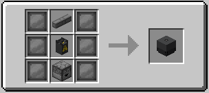
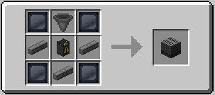
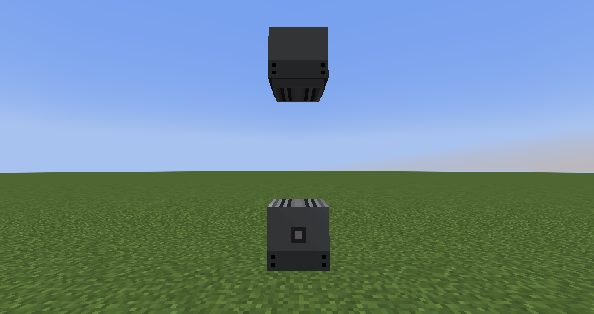

Decon Shower
============

The Decon Shower is a block which is used to Deconaminate yourself after having been contaminated by something radioactive.

You also have the Decon Shower Drain, which drains all the contaminated water out of the shower.

Recipe(Decon Shower):

Recipe(Decon Shower Drain):

Total Decon Shower Build:
